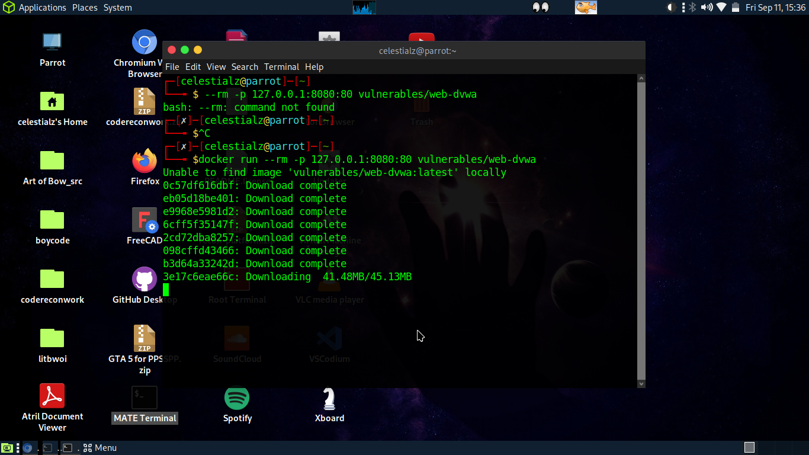
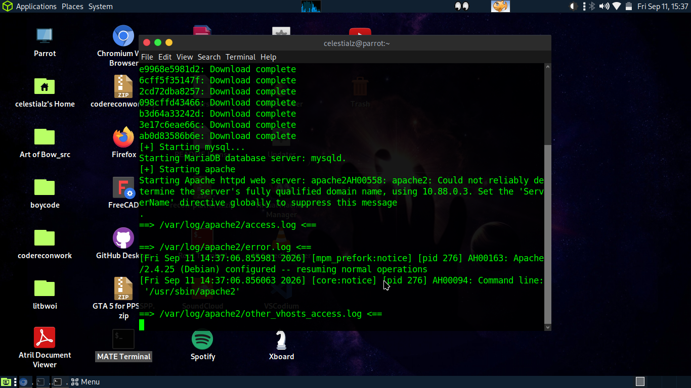
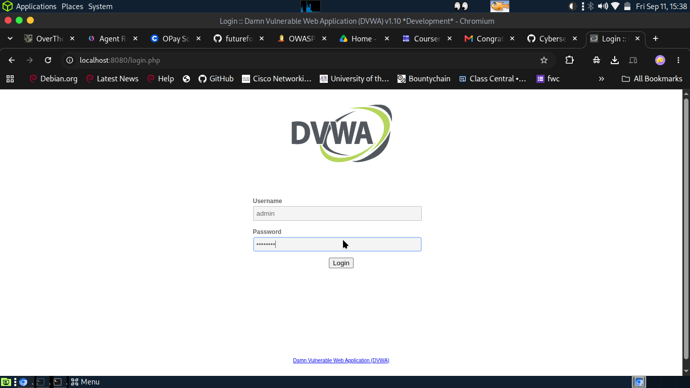
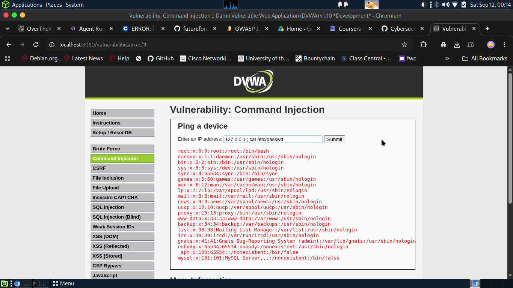
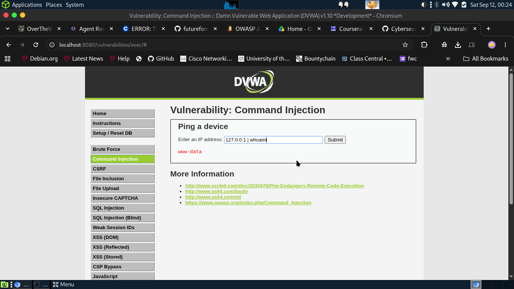
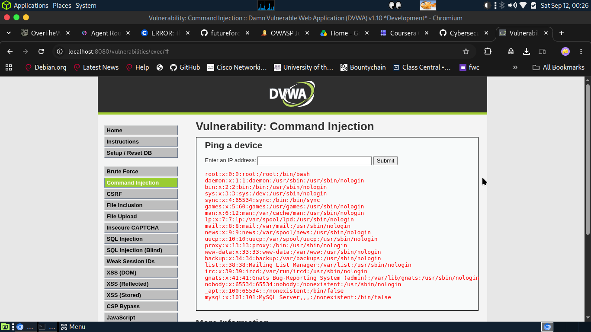

# DVWA: Command Injection Walkthrough

A step-by-step exploitation of the **Command Injection** module in
[DVWA](https://github.com/digininja/DVWA) (Damn Vulnerable Web Application),
from spinning up the lab in Docker through defeating the **Low**, **Medium**,
and **High** security levels.

> ⚠️ **Lab use only.** DVWA is intentionally vulnerable software running on my
> own machine, bound to `127.0.0.1`. Only ever test systems you own or are
> explicitly authorised to test.

---

## Lab Setup

DVWA was run locally with Docker, published to loopback only so nothing is
exposed to the network:

```bash
docker run --rm -p 127.0.0.1:8080:80 vulnerables/web-dvwa
```

[](DVWA_SCREENSHOTS/01-docker-run.png)

The container brings up MariaDB and Apache:

[](DVWA_SCREENSHOTS/02-container-up.png)

Logged in at `http://localhost:8080/login.php` with the default credentials
**admin / password**:

[](DVWA_SCREENSHOTS/03-login.png)

Then initialised the database from **Setup / Reset DB** (the Setup Check
confirms PHP, MySQL, and the modules are ready):

[](DVWA_SCREENSHOTS/04-setup-check.png)

---

## Objective

The **Command Injection** module offers a *"Ping a device"* form that takes an
IP address and runs it through a shell `ping` command. The goal is to break out
of the intended command and run **arbitrary OS commands** on the host — at each
of the three security levels.

---

## Exploit Breakdown

### 1. Low Security

- **Vulnerability:** No input validation at all. Whatever you type in the `ip`
  field is concatenated straight into a shell command.
- **Payload:** `127.0.0.1 ; cat /etc/passwd`
- **Result:** The `;` terminates the `ping` and chains a second command. The app
  happily returns the full contents of `/etc/passwd`.

[](DVWA_SCREENSHOTS/05-low-cat-passwd.png)

### 2. Medium Security

- **Vulnerability:** A weak blacklist. The code strips `;` and `&&` from the
  input — but forgets the pipe (`|`), so command chaining still works.
- **Payload:** `127.0.0.1 | whoami`
- **Result:** The pipe survives the filter and executes. The response returns
  `www-data`, confirming command execution as the Apache web-server user.

[](DVWA_SCREENSHOTS/06-medium-whoami.png)

### 3. High Security

- **Vulnerability:** A stricter blacklist that removes `&`, `;`, `-`, `$`, `(`,
  `)`, backticks, `||`, and `"| "` — a pipe **followed by a space**. The bug is
  that a pipe with *no* trailing space slips right through.
- **Payload:** `127.0.0.1|cat /etc/passwd`  *(note: no space after the `|`)*
- **Result:** The spaceless pipe evades the filter and `/etc/passwd` is dumped
  again — even at High.

First switch the security level to **High**:

[](DVWA_SCREENSHOTS/07-security-high.png)

Then submit the spaceless payload:

[](DVWA_SCREENSHOTS/08-high-cat-passwd.png)

---

## Key Takeaway

Every level here fell to the same idea: **blacklisting characters is a losing
game.** Low had no filter, Medium forgot the pipe, and High forgot that a pipe
doesn't need a trailing space. There is always one more separator the blacklist
missed.

Proper remediation:

- **Whitelist, don't blacklist.** Validate the input against a strict allowlist —
  for a ping field, only accept a well-formed IP address and reject everything else.
- **Don't hand user input to a shell.** Avoid `shell_exec()`, `system()`,
  `exec()`, etc. Use language-native networking libraries instead of shelling out.
- **If a shell call is unavoidable,** use parameterised execution and escape/validate
  every argument — never string-concatenate user input into a command.
