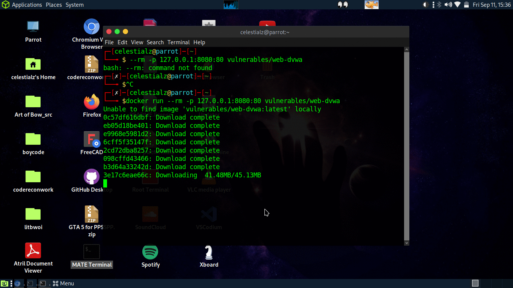
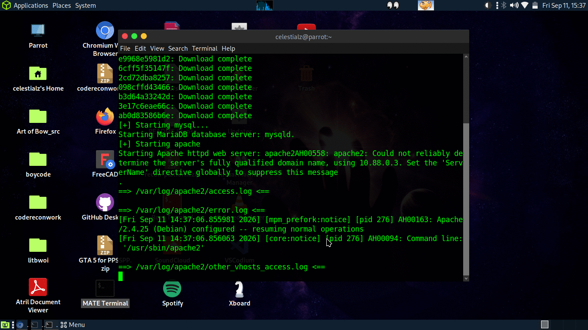
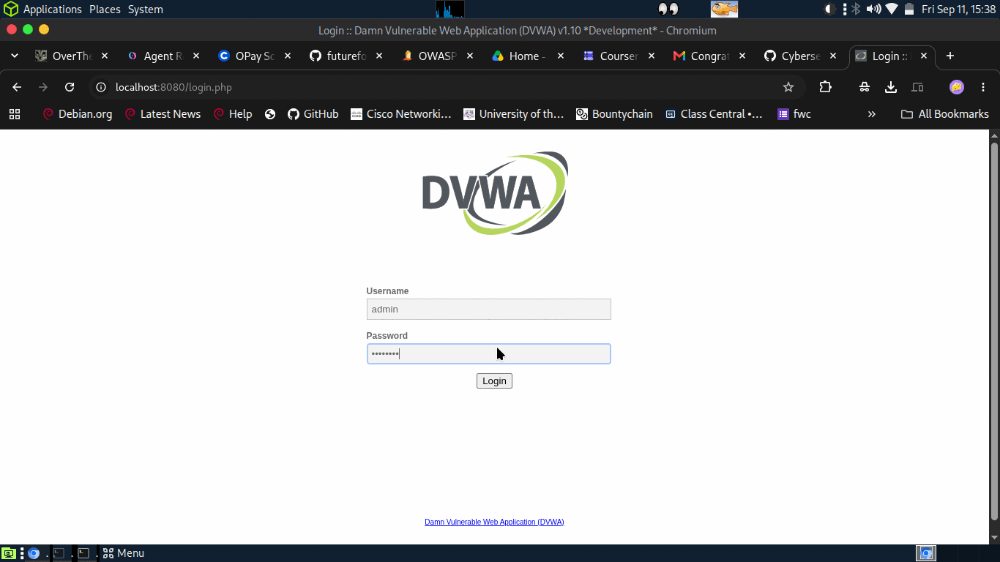
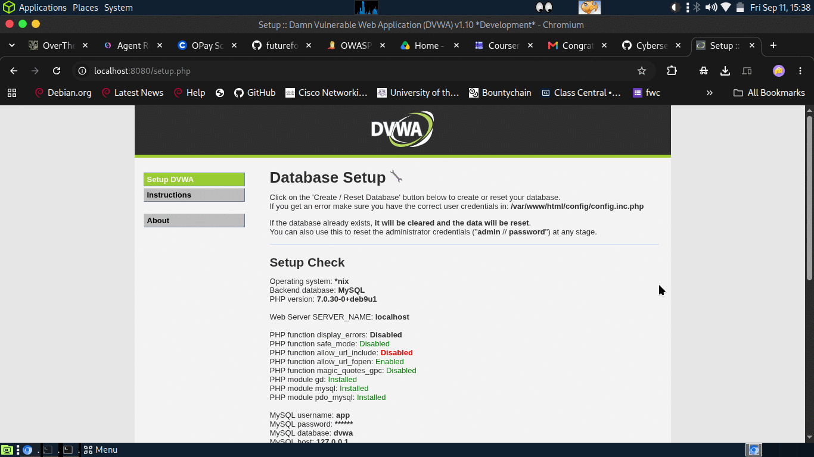
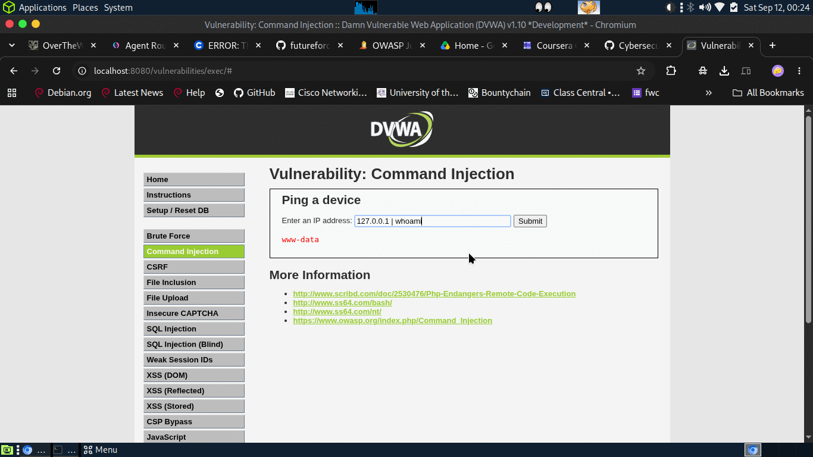
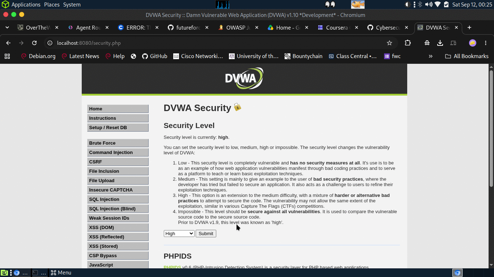

# Command Injection on DVWA

I'd read about command injection plenty of times, but reading about it and
actually watching a machine hand you its password file because you typed one
semicolon are two very different things. So I fired up DVWA and worked through
the Command Injection module properly — from the Low setting all the way up to
High. This is how it went.

> This all runs in a throwaway lab on my own machine. DVWA is *made* to be broken
> into — please don't try any of this against anything you don't own.

## Getting it running

I ran DVWA in Docker and kept it bound to localhost only:

```bash
docker run --rm -p 127.0.0.1:8080:80 vulnerables/web-dvwa
```

First go I actually fumbled it — left off the `docker run` part and bash just
went `--rm: command not found`. You can spot it in the screenshot. Leaving it in
because that's honestly how it happened.



Once the image finished pulling, the container brought up MariaDB and Apache:



Then I logged in with the default `admin` / `password`:



…and reset the database from **Setup / Reset DB** so I was starting from a clean
slate:



## The target

The module gives you a little **"Ping a device"** box. You hand it an IP, the
server runs `ping` on it, and shows you the output. So the whole challenge is
really one question: can I get it to run something that *isn't* ping? Short
answer — yes, and in three different ways depending on how hard each level tried
to stop me.

## Low — no lock on the door

Low has basically no filtering. Whatever I type gets tacked straight onto the
ping command, so I just tacked on a second command of my own:

```
127.0.0.1 ; cat /etc/passwd
```

The `;` ends the ping and kicks off my `cat`. And there it was — the whole
`/etc/passwd`:


Seeing it actually work the first time is a weird little "wait, that's genuinely
it?" moment.

## Medium — they tried

Medium actually puts up a fight. It strips out `;` and `&&`, so the semicolon
trick dies here. But it completely forgot about the pipe. So instead of chaining
with a semicolon, I piped:

```
127.0.0.1 | whoami
```

It came straight back with `www-data` — the user Apache runs as. So it ran my
command *and* told me exactly who I am on the box:



## High — closer, still not enough

High has a much longer blacklist, and this time it does go after the pipe — but
only `"| "`, a pipe with a *space* after it. So I just… took the space out.

First I flipped the security level over to High:



Then sent the pipe with nothing after it:

```
127.0.0.1|cat /etc/passwd
```

And `/etc/passwd` came pouring out again — on the setting that's supposed to be
the hard one:


## What I took from it

The pattern that jumped out at me: every level tried to stop me by banning
*characters*, and every single one lost. Ban `;`, I use `|`. Ban `| `, I drop
the space. There's always one more separator they didn't think of — blacklisting
is whack-a-mole, and the attacker gets the last mole.

If I were the one fixing this, I'd:

- only accept input that actually looks like an IP address and bin the rest —
  decide what's *allowed* instead of trying to list everything that's banned
- stop feeding user input into the shell at all, and use the language's own
  networking libraries instead of `shell_exec()` / `system()`
- and if I really had no choice but to shell out, pass the arguments across
  safely instead of gluing a command string together by hand

Next thing I want to try here is going past just reading files — seeing if I can
turn this into an actual shell back to my machine.
